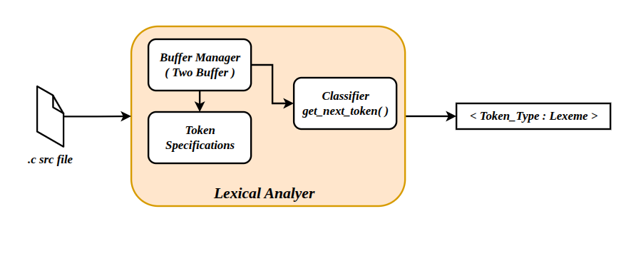
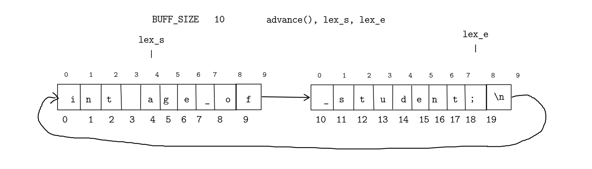

## *Lexcial Analyzer*

 *A lexical analyzer implemented using `C` for C Programming Language that accepts a `.c` file and produces list of token in the format `<Token_Type:Lexeme>`.*


 ## Block Diagram
 


## *Features*
*The System will be able to recognize the following tokens.*

- Identifier
- Keyword
- Integer and Floating Point Literals
- Char and String Literals
- Operators
- Special Characters
- Preprocessor Directives


*The System has two buffers to read stream of chars from the src file, to correctly synchronize the tokens that spans greater than the size of the buffer.* 
*Also the System will report an error if no matching brackets found, using stack based state machine.*





## *Project Structure*

```text
LEXER/
├── img/                # Images used in the README
│
├── include/            # Header files
│   ├── buff_manager.h
│   ├── classifier.h
│   ├── helper.h
│   ├── stack.h
│   └── token_spec.h
│
├── src/                # Source files
│   ├── buff_manager.c
│   ├── classifier.c
│   ├── helper.c
│   ├── main.c
│   ├── stack.c
│   └── token_spec.c
│
├── Test/               # Test programs
│   └── test.c
│
├── .gitignore
├── Makefile
└── README.md
```


## Build and Run
1. Move into the directory you want this project to be downloaded

    ```
    git clone ""
    ```